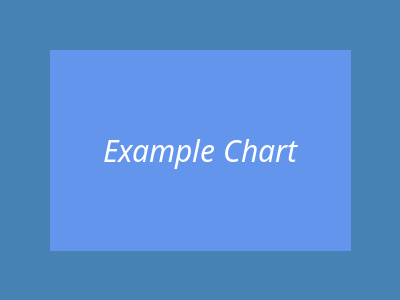
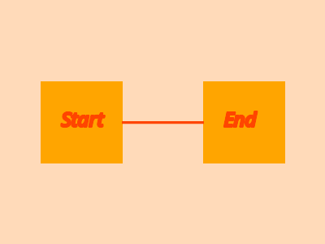

Lorem
=====

Lorem :doc:`ipsum` dolor :doc:`sit` :doc:`amet`, consectetur :doc:`dolor/adipiscing` elit, sed do eiusmod :doc:`tempor` incididunt ut :doc:`labore` et dolore :doc:`magna` aliqua.
Ut enim ad minim :doc:`veniam`, quis nostrud exercitation ullamco :doc:`laboris` nisi ut aliquip ex ea commodo consequat.
Duis aute irure :doc:`dolor/index` in :term:`reprehenderit` in voluptate velit esse cillum dolore eu fugiat nulla pariatur.
Excepteur sint occaecat cupidatat non proident, sunt in culpa qui officia deserunt mollit anim id est :doc:`laborum`.

Example Chart
-------------

Below is an example chart showing the relationships between different components:

   An example chart demonstrating component relationships

Process Workflow
----------------

The following diagram illustrates the typical workflow:

Additional Information
----------------------

This is a central hub page that connects to many other topics. For more detailed information, see:

- :doc:`dolor/consectetur` - Consectetur documentation
- :doc:`dolor/elit` - Elit reference
- :doc:`dolor/eiusmod` - Eiusmod guide
- :doc:`dolor/incididunt` - Incididunt details

Related example pages include :doc:`ipsum`, :doc:`sit`, :doc:`amet`, and :doc:`tempor`.
